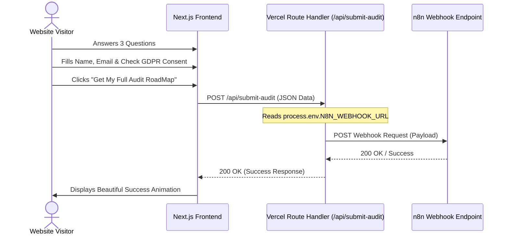

# Implementation Plan: N8N Webhook Integration for Audit Roadmap

This document outlines the step-by-step implementation plan for capturing user details and security answers through a 3-question quiz on the NordWacht website, routing it securely through a Vercel Serverless Function to avoid CORS, and triggering an n8n webhook workflow.

---

## 1. Objectives

- **Qualify Leads**: Allow users to answer a 3-question cybersecurity diagnostic quiz.
- **Lead Capture & GDPR Compliance**: Collect user's First Name, Last Name, Work Email, and a mandatory GDPR consent checkbox before they can receive their custom roadmap.
- **Secure Webhook Routing**: Replace the dummy/mailto logic with a Vercel Serverless Function API route that handles the POST request, appends credentials/webhook URLs server-side, and calls n8n.
- **CORS Resolution**: Execute the webhook call on the Vercel server side to avoid client-side CORS issues with n8n.
- **Vibrant & Premium UI**: Match the high-end NordWacht aesthetic with glassmorphism, smooth animations, clear feedback states, and dark mode compliance.

---

## 2. Architecture & Data Flow



---

## 3. Implementation Steps

### Step 1: Backend Route Handler (`/src/app/api/submit-audit/route.ts`)
Create a Next.js Route Handler to act as a secure proxy to n8n.
- **Path**: `src/app/api/submit-audit/route.ts`
- **Method**: `POST`
- **Responsibilities**:
  - Validate payload (First Name, Last Name, Email, GDPR compliance, and answers to the 3 questions).
  - Retrieve the webhook URL securely from `process.env.N8N_WEBHOOK_URL`.
  - Fetch the webhook URL with the payload using a server-to-server POST request.
  - Gracefully handle network/n8n down-states and return clean JSON response to client.

### Step 2: Environment Variables (`.env.local`)
Add the webhook endpoint configuration:
```env
# n8n Integration Webhook URL
N8N_WEBHOOK_URL=https://primary-n8n-instance-webhook-url/webhook/xyz
```

### Step 3: Audit Roadmap Quiz Modal (`src/components/booking/RoadmapModal.tsx`)
Create a custom, high-converting modal for the 3-question diagnostic and contact capture.
- **Step 1: Quiz Questions**:
  1. **Infrastructure**: What is your primary infrastructure environment? *(Cloud-native / On-Prem / Hybrid)*
  2. **Compliance Focus**: Which compliance framework is your highest priority? *(SOC 2 / ISO 27001 / GDPR or HIPAA / None)*
  3. **Security Threat Concern**: What is your primary security concern? *(Data Leakage / Phishing & Social Engineering / Cloud Misconfiguration / Vendor Risk)*
- **Step 2: Contact Form & GDPR**:
  - Input: First Name (required)
  - Input: Last Name (required)
  - Input: Work Email (required, basic email validation)
  - Checkbox: GDPR Compliance Checkbox (required)
- **Submit Button**: "Get My Full Audit RoadMap" with loading spinner and active transition state.
- **Success State**: Premium animated success block reassuring the user that their roadmap is on the way.

### Step 4: Context and Trigger Integration (`src/app/page.tsx` & `src/components/booking/BookingProvider.tsx`)
- Add `openRoadmapModal` and `closeRoadmapModal` triggers in `BookingProvider.tsx`.
- Connect the "View Solutions" button on `src/app/page.tsx` (or add a dedicated "Get Free Audit Roadmap" primary CTA) to trigger the `RoadmapModal`.
- Make sure `RoadmapModal` is mounted in `src/app/layout.tsx` globally so it can be invoked anywhere.

---

## 4. Proposed Payload Structure

The Vercel Serverless Function will receive and forward the following payload to n8n:

```json
{
  "firstName": "John",
  "lastName": "Doe",
  "email": "john@company.com",
  "gdprConsent": true,
  "submittedAt": "2026-05-17T12:35:00Z",
  "quizAnswers": {
    "infrastructure": "Cloud-native",
    "compliance": "SOC 2",
    "securityPriority": "Data Leakage"
  }
}
```

---

## 5. UI/UX Refinement Checklist

- [ ] **Glassmorphism Design**: Use dark semi-transparent overlays (`bg-black/60` and `backdrop-blur-sm`) to create an ultra-premium feel.
- [ ] **Interactive Selected States**: Quiz option buttons must have glowing borders and smooth scale transitions when hover/selected.
- [ ] **Validation Feedback**: Provide clean inline validation for email formatting and ensure the GDPR consent checkbox is checked before allowing submit.
- [ ] **Loading & Transition Animations**: Animate step changes and display a smooth micro-animation during n8n API fetch.
- [ ] **Accessibility**: Full keyboard support (Close with ESC, trapping tabs).

---

## 6. Testing & Deployment Verification

1. **Local Test**: Verify that `.env.local` is read correctly and the Serverless Route proxy succeeds or handles errors gracefully when the webhook is mocked.
2. **Payload Check**: Open browser inspector and trace the request to `/api/submit-audit` to ensure no environment variables or webhook URLs are leaked to the client.
3. **CORS Validation**: Confirm no CORS blockages occur on client-side requests.
4. **Vercel Build**: Run `npm run build` locally to guarantee zero TypeScript or build-time compilation errors.
