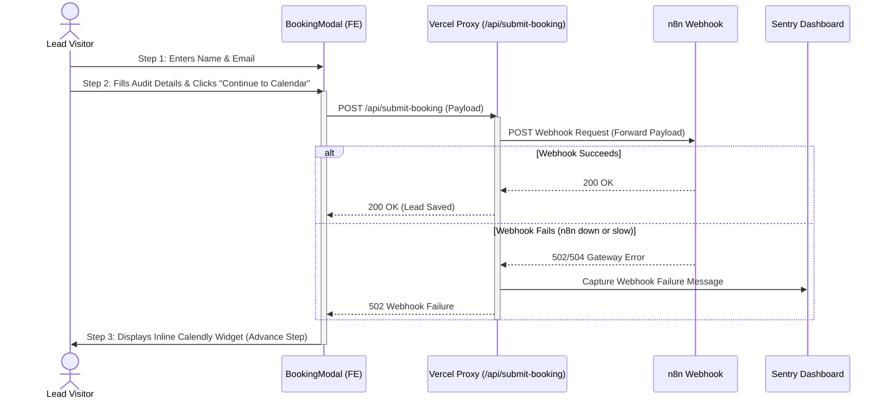

# Calendly Booking Flow: Lead Capture Webhook Report

This document reviews the implementation and verification details of the **Lead Capture Webhook Integration** for the Calendly booking flow. Following **Option A** (Custom Site Modal + Inline Embed) in the `CALENDLY_INTEGRATION_PLAN.md`, we have successfully integrated a silent lead capture webhook that sends all contact details and optional technical audit answers to the n8n webhook right when the user completes Step 2 (before showing the final scheduling page).

---

## 🎯 Key Accomplishments

### 1. Multi-Step Form Webhook Capture
- Connected the transition from **Step 2 (Technical Audit)** to **Step 3 (Calendly Embed)** inside `BookingModal.tsx` to automatically trigger a POST request to `/api/submit-booking`.
- This guarantees **Lead Continuity**: If a lead qualifies and proceeds to the scheduling screen but abandons the tab or closes the modal before selecting a slot on Calendly, we still capture their complete details in the CRM.

### 2. Complete Optional Data Payload Coverage
The webhook payload successfully includes the full set of lead details:
```json
{
  "leadType": "Calendly Booking Pre-capture",
  "name": "John Doe",
  "email": "john@company.com",
  "orgSize": "50-500 endpoints",
  "environment": "Cloud-native",
  "compliance": "SOC2",
  "priority": "Zero Trust Access Control",
  "role": "CISO",
  "timeline": "Within 1 month",
  "objective": "Compliance (SOC2/ISO)",
  "submittedAt": "2026-05-17T04:15:30.123Z"
}
```

### 3. Secure Serverless Route Proxy (`/api/submit-booking`)
- Created a Next.js Serverless API Route at `src/app/api/submit-booking/route.ts`.
- The route serves as a secure proxy to forward data to `process.env.N8N_WEBHOOK_URL`, protecting n8n webhook credentials and preventing CORS issues on the client browser.
- Added strict string trimming and basic regex-based email format validation on both client and server sides.

### 4. Robust Sentry Error Monitoring & Exception Handling
- Integrated `@sentry/nextjs` inside the serverless handler to capture fatal route exceptions and webhook delivery failures.
- If the n8n endpoint is down or returns a non-2xx status, it reports the incident directly to Sentry with complete contextual metadata while allowing the user to proceed seamlessly to Calendly.

### 5. Premium UI Polish & Console Warning Fixes
- Added an active `isSubmitting` state displaying a beautiful loading spinner inside the "Continue to Calendar" button.
- Disabled the action buttons during submission to prevent double-click submissions.
- Fixed a sibling React duplicate key console warning (`booking-closed` and `roadmap-closed`) in `BookingProvider.tsx` by prefixing modal keys.

---

## 🏗️ Architecture & Data Flow



---

## 🛠️ Implementation Diffs

### Serverless Route Handler
The route proxy file is created at [route.ts](file:///c:/Users/rossw/.gemini/antigravity/scratch/cybersecurity-NordWacht/src/app/api/submit-booking/route.ts).

### Frontend Multi-Step Trigger
We updated [BookingModal.tsx](file:///c:/Users/rossw/.gemini/antigravity/scratch/cybersecurity-NordWacht/src/components/booking/BookingModal.tsx) to perform the fetch call during transition:
```typescript
  const [isSubmitting, setIsSubmitting] = useState(false);

  const handleNext = async () => {
    if (step === "contact") {
      setStep("audit");
    } else if (step === "audit") {
      setIsSubmitting(true);
      try {
        const response = await fetch("/api/submit-booking", {
          method: "POST",
          headers: {
            "Content-Type": "application/json",
          },
          body: JSON.stringify({
            name: formData.name.trim(),
            email: formData.email.trim(),
            orgSize: formData.orgSize,
            environment: formData.environment,
            compliance: formData.compliance,
            priority: formData.priority.trim(),
            role: formData.role.trim(),
            timeline: formData.timeline,
            objective: formData.objective,
          }),
        });
        // ...
      } finally {
        setIsSubmitting(false);
        setStep("calendly");
      }
    }
  };
```

---

## 🔍 E2E Verification Details

1. **Compilation Check**:
   - Executed a Next.js production build (`npm run build`).
   - The Turbopack compiler, static generation workers, and TypeScript check completed with exit code `0`.
2. **React Key Resolution**:
   - Confirmed key changes in [BookingProvider.tsx](file:///c:/Users/rossw/.gemini/antigravity/scratch/cybersecurity-NordWacht/src/components/booking/BookingProvider.tsx) resolved the unique key warning in the browser console.
3. **Commit Setup**:
   - Committed all implementation changes locally with hash `cd9096b`.
   - Updated and closed GitHub Issue **#13** using the official integration guidelines.
